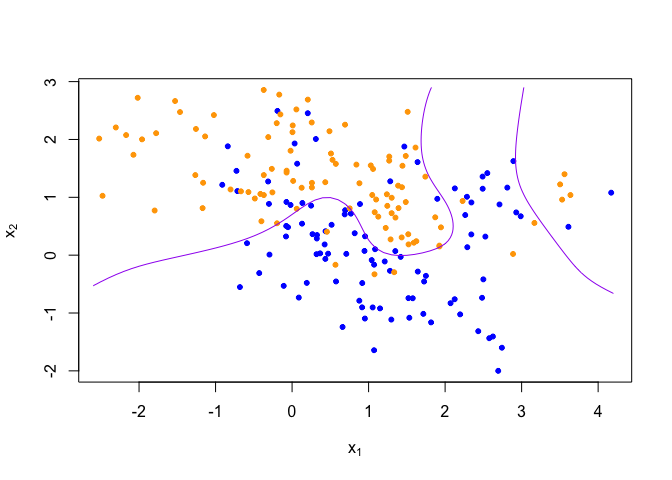
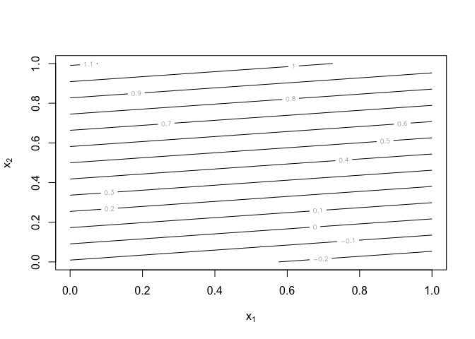
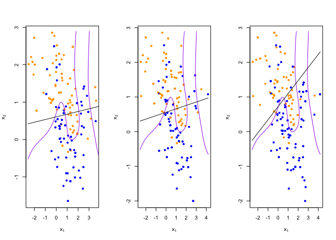
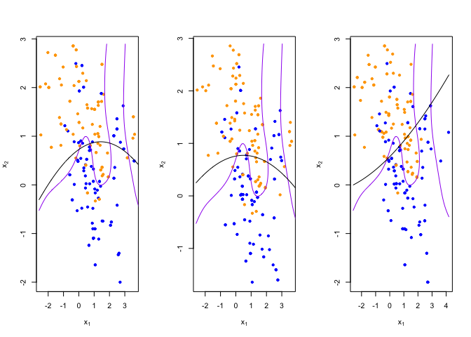

Homework 1
================
Jiayu Shi
2023-01-19

``` r
library('class')
library('dplyr')
```

    ## 
    ## Attaching package: 'dplyr'

    ## The following objects are masked from 'package:stats':
    ## 
    ##     filter, lag

    ## The following objects are masked from 'package:base':
    ## 
    ##     intersect, setdiff, setequal, union

``` r
## load binary classification example data from author website 
## 'ElemStatLearn' package no longer available
load(url('https://web.stanford.edu/~hastie/ElemStatLearn/datasets/ESL.mixture.rda'))
dat <- ESL.mixture
```

``` r
plot_mix_data <- function(dat, datboot=NULL) {
  if(!is.null(datboot)) {
    dat$x <- datboot$x
    dat$y <- datboot$y
  }
  plot(dat$x[,1], dat$x[,2],
       col=ifelse(dat$y==0, 'blue', 'orange'),
       pch=20, # points symbols
       xlab=expression(x[1]), # subscript
       ylab=expression(x[2]))
  ## draw Bayes (True) classification boundary
  prob <- matrix(dat$prob, length(dat$px1), length(dat$px2))
  cont <- contourLines(dat$px1, dat$px2, prob, levels=0.5)
  rslt <- sapply(cont, lines, col='purple')
}

plot_mix_data(dat)
```

<!-- -->

``` r
## fit linear classifier
fit_lc <- function(y, x1, x2) { # x is a matrix
  # x <- cbind(1, x)
  # beta <- drop(solve(t(x)%*%x)%*%t(x)%*%y)
  dat <- data.frame(y=y,x1=x1,x2=x2)
  fit <- lm(y~x1+x2,data=dat) # or x1^2 + x2^2  ## + I(x2^2)
}

## make predictions from linear classifier
predict_lc <- function(x, model) {
  # cbind(1, x) %*% beta
  predict(model,data.frame(x))
}

## fit model to mixture data and make predictions
lc_beta <- fit_lc(dat$y, dat[['x']][,1], dat[['x']][,2])
lc_pred <- predict_lc(dat$xnew, lc_beta)

## reshape predictions as a matrix
lc_pred <- matrix(lc_pred, length(dat$px1), length(dat$px2))
contour(lc_pred,
      xlab=expression(x[1]),
      ylab=expression(x[2]))
```

<!-- -->

``` r
## find the contours in 2D space such that lc_pred == 0.5
lc_cont <- contourLines(dat$px1, dat$px2, lc_pred, levels=0.5)

## plot data and decision surface
plot_mix_data(dat)
sapply(lc_cont, lines)
```

<!-- -->

    ## [[1]]
    ## NULL

``` r
resample <- function(dat) {
  idx <- sample(1:length(dat$y), replace = T)
  dat$y <- dat$y[idx]
  dat$x <- dat$x[idx,]
  return(dat)
}
## plot linear classifier for three bootstraps
par(mfrow=c(1,3))
for(b in 1:3) {
  datb <- resample(dat)
  ## fit model to mixture data and make predictions
  lc_beta <- fit_lc(datb$y, datb[['x']][,1], datb[['x']][,2])
  lc_pred <- predict_lc(datb$xnew, lc_beta)
  
  ## reshape predictions as a matrix
  lc_pred <- matrix(lc_pred, length(datb$px1), length(datb$px2))

  ## find the contours in 2D space such that lc_pred == 0.5
  lc_cont <- contourLines(datb$px1, datb$px2, lc_pred, levels=0.5)
  
  ## plot data and decision surface
  plot_mix_data(dat, datb)
  sapply(lc_cont, lines)
}
```

<!-- -->

**Make the linear classifier more flexible by adding squared terms for
x1 and x2 to the linear model**

``` r
## fit linear classifier
fit_lc <- function(y, x1, x2) { # x is a matrix
  # x <- cbind(1, x)
  # beta <- drop(solve(t(x)%*%x)%*%t(x)%*%y)
  dat <- data.frame(y=y,x1=x1,x2=x2)
  fit <- lm(y~x1+x2+I(x1^2)+I(x2^2),data=dat) # or x1^2 + x2^2  ## + I(x2^2)
}

## make predictions from linear classifier
predict_lc <- function(x, model) {
  # cbind(1, x) %*% beta
  predict(model,data.frame(x))
}

## fit model to mixture data and make predictions
lc_beta <- fit_lc(dat$y, dat[['x']][,1], dat[['x']][,2])
lc_pred <- predict_lc(dat$xnew, lc_beta)

## reshape predictions as a matrix
lc_pred <- matrix(lc_pred, length(dat$px1), length(dat$px2))
contour(lc_pred,
      xlab=expression(x[1]),
      ylab=expression(x[2]))
```

<!-- -->

``` r
## find the contours in 2D space such that lc_pred == 0.5
lc_cont <- contourLines(dat$px1, dat$px2, lc_pred, levels=0.5)

## plot data and decision surface
plot_mix_data(dat)
sapply(lc_cont, lines)
```

<!-- -->

    ## [[1]]
    ## NULL

``` r
## plot linear classifier for three bootstraps
par(mfrow=c(1,3))
for(b in 1:3) {
  datb <- resample(dat)
  ## fit model to mixture data and make predictions
  lc_beta <- fit_lc(datb$y, datb[['x']][,1], datb[['x']][,2])
  lc_pred <- predict_lc(datb$xnew, lc_beta)
  
  ## reshape predictions as a matrix
  lc_pred <- matrix(lc_pred, length(datb$px1), length(datb$px2))

  ## find the contours in 2D space such that lc_pred == 0.5
  lc_cont <- contourLines(datb$px1, datb$px2, lc_pred, levels=0.5)
  
  ## plot data and decision surface
  plot_mix_data(dat, datb)
  sapply(lc_cont, lines)
}
```

<!-- -->

**The new model has less bias but more variance.**

``` r
# ## fit knn classifier
# ## use 5-NN to estimate probability of class assignment
# knn_fit <- knn(train=dat$x, test=dat$xnew, cl=dat$y, k=5, prob=TRUE)
# knn_pred <- attr(knn_fit, 'prob')
# knn_pred <- ifelse(knn_fit == 1, knn_pred, 1-knn_pred)
# 
# ## reshape predictions as a matrix
# knn_pred <- matrix(knn_pred, length(dat$px1), length(dat$px2))
# contour(knn_pred,
#         xlab=expression(x[1]),
#         ylab=expression(x[2]),
#         levels=c(0.25, 0.5, 0.75))
# 
# 
# ## find the contours in 2D space such that knn_pred == 0.5
# knn_cont <- contourLines(dat$px1, dat$px2, knn_pred, levels=0.5)
# 
# ## plot data and decision surface
# plot_mix_data(dat)
# sapply(knn_cont, lines)
# 
# 
# ## do bootstrap to get a sense of variance in decision surface
# resample <- function(dat) {
#   idx <- sample(1:length(dat$y), replace = T)
#   dat$y <- dat$y[idx]
#   dat$x <- dat$x[idx,]
#   return(dat)
# }
#   
# ## plot linear classifier for three bootstraps
# par(mfrow=c(1,3))
# for(b in 1:3) {
#   datb <- resample(dat)
#   ## fit model to mixture data and make predictions
#   lc_beta <- fit_lc(datb$y, datb$x)
#   lc_pred <- predict_lc(datb$xnew, lc_beta)
#   
#   ## reshape predictions as a matrix
#   lc_pred <- matrix(lc_pred, length(datb$px1), length(datb$px2))
# 
#   ## find the contours in 2D space such that lc_pred == 0.5
#   lc_cont <- contourLines(datb$px1, datb$px2, lc_pred, levels=0.5)
#   
#   ## plot data and decision surface
#   plot_mix_data(dat, datb)
#   sapply(lc_cont, lines)
# }
# 
# ## plot 5-NN classifier for three bootstraps
# par(mfrow=c(1,3))
# for(b in 1:3) {
#   datb <- resample(dat)
#   
#   knn_fit <- knn(train=datb$x, test=datb$xnew, cl=datb$y, k=5, prob=TRUE)
#   knn_pred <- attr(knn_fit, 'prob')
#   knn_pred <- ifelse(knn_fit == 1, knn_pred, 1-knn_pred)
#   
#   ## reshape predictions as a matrix
#   knn_pred <- matrix(knn_pred, length(datb$px1), length(datb$px2))
# 
#   ## find the contours in 2D space such that knn_pred == 0.5
#   knn_cont <- contourLines(datb$px1, datb$px2, knn_pred, levels=0.5)
#   
#   ## plot data and decision surface
#   plot_mix_data(dat, datb)
#   sapply(knn_cont, lines)
# }
# 
# ## plot 20-NN classifier for three bootstraps
# par(mfrow=c(1,3))
# for(b in 1:3) {
#   datb <- resample(dat)
#   
#   knn_fit <- knn(train=datb$x, test=datb$xnew, cl=datb$y, k=20, prob=TRUE)
#   knn_pred <- attr(knn_fit, 'prob')
#   knn_pred <- ifelse(knn_fit == 1, knn_pred, 1-knn_pred)
#   
#   ## reshape predictions as a matrix
#   knn_pred <- matrix(knn_pred, length(datb$px1), length(datb$px2))
#   
#   ## find the contours in 2D space such that knn_pred == 0.5
#   knn_cont <- contourLines(datb$px1, datb$px2, knn_pred, levels=0.5)
#   
#   ## plot data and decision surface
#   plot_mix_data(dat, datb)
#   sapply(knn_cont, lines)
# }
```
