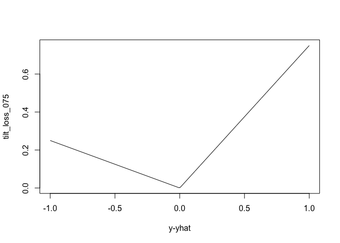
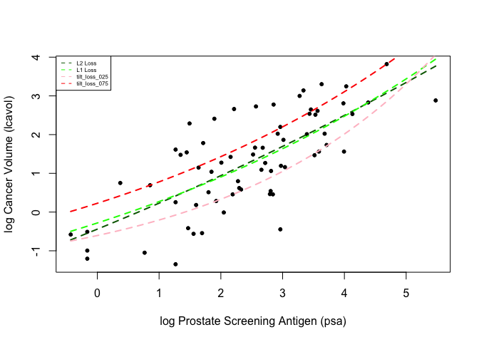

Homework 2
================
Jiayu Shi
2023-01-31

``` r
## load prostate data
prostate <- 
  read.table(url(
    'https://web.stanford.edu/~hastie/ElemStatLearn/datasets/prostate.data'))

## subset to training examples
prostate_train <- subset(prostate, train==TRUE)

## plot lcavol vs lpsa
plot_psa_data <- function(dat=prostate_train) {
  plot(dat$lpsa, dat$lcavol,
       xlab="log Prostate Screening Antigen (psa)",
       ylab="log Cancer Volume (lcavol)",
       pch = 20)
}
plot_psa_data()

############################
## regular linear regression
############################

## L2 loss function
L2_loss <- function(y, yhat)
  (y-yhat)^2

## fit simple linear model using numerical optimization
fit_lin <- function(y, x, loss=L2_loss, beta_init = c(-0.51, 0.75)) {
  err <- function(beta)
    mean(loss(y,  beta[1] + beta[2]*x))
  beta <- optim(par = beta_init, fn = err)
  return(beta)
}

## make predictions from linear model
predict_lin <- function(x, beta)
  beta[1] + beta[2]*x

## fit linear model
lin_beta <- fit_lin(y=prostate_train$lcavol,
                    x=prostate_train$lpsa,
                    loss=L2_loss)

## compute predictions for a grid of inputs
x_grid <- seq(min(prostate_train$lpsa),
              max(prostate_train$lpsa),
              length.out=100)
lin_pred <- predict_lin(x=x_grid, beta=lin_beta$par)

## plot data
plot_psa_data()

## plot predictions
lines(x=x_grid, y=lin_pred, col='darkgreen', lwd=2)

## do the same thing with 'lm'
lin_fit_lm <- lm(lcavol ~ lpsa, data=prostate_train)

## make predictins using 'lm' object
lin_pred_lm <- predict(lin_fit_lm, data.frame(lpsa=x_grid))

## plot predictions from 'lm'
lines(x=x_grid, y=lin_pred_lm, col='pink', lty=2, lwd=2)
```

<!-- -->

``` r
##################################
## try modifying the loss function
##################################

tilt_loss_025 <- function(y, yhat)
  qrnn::tilted.abs(y-yhat, tau = 0.25)

## plot tilt_loss_025 function
err_grd <- seq(-1,1,length.out=200)
plot(err_grd, tilt_loss_025(err_grd,0), type='l',
     xlab='y-yhat', ylab='tilt_loss_025')
```

<!-- -->

``` r
tilt_loss_075 <- function(y, yhat)
  qrnn::tilted.abs(y-yhat, tau = 0.75)

## plot tilt_loss_075 function
err_grd <- seq(-1,1,length.out=200)
plot(err_grd, tilt_loss_075(err_grd,0), type='l',
     xlab='y-yhat', ylab='tilt_loss_075')
```

<!-- -->

``` r
L1_loss <- function(y, yhat)
  abs(y-yhat)

## plot L1 loss function
err_grd <- seq(-1,1,length.out=200)
plot(err_grd, L1_loss(err_grd,0), type='l',
     xlab='y-yhat', ylab='L1_loss')
```

<!-- -->

``` r
## linear model with tilt_loss_025
lin_beta_tilt_loss_025<- fit_lin(y=prostate_train$lcavol,
                           x=prostate_train$lpsa,
                           loss=tilt_loss_025)

lin_pred_tilt_loss_025 <- predict_lin(x=x_grid, beta=lin_beta_tilt_loss_025$par)

## linear model with tilt_loss_075

lin_beta_tilt_loss_075 <- fit_lin(y=prostate_train$lcavol,
                                  x=prostate_train$lpsa,
                                  loss=tilt_loss_075)

lin_pred_tilt_loss_075 <- predict_lin(x=x_grid, beta=lin_beta_tilt_loss_075$par)


## linear model with L1 loss 

lin_beta_L1 <- fit_lin(y=prostate_train$lcavol,
                       x=prostate_train$lpsa,
                       loss=L1_loss)

lin_pred_L1 <- predict_lin(x=x_grid, beta=lin_beta_L1$par)

## plot data
plot_psa_data()

lines(x=x_grid, y=lin_pred, col='darkgreen', lwd=2, lty=2)

lines(x=x_grid, y=lin_pred_L1, col='green', lwd=2, lty=2)

lines(x=x_grid, y=lin_pred_tilt_loss_025, col='pink', lwd=2, lty=2)

lines(x=x_grid, y=lin_pred_tilt_loss_075, col='red', lwd=2, lty=2)

legend("topleft", legend=c("L2 Loss", "L1 Loss", "tilt_loss_025", "tilt_loss_075"),
       col=c("darkgreen", "green", "pink", "red"), lty=c(2,2,2,2), cex=0.5)
```

<!-- -->

``` r
##################################
## Non Linear Model
##################################

fit_nl <- function(y, x, loss=L2_loss, beta_init = c(-1.0, 0.0, -0.3 )) {
  err <- function(beta)
    mean(loss(y,  beta[1] + beta[2]*exp(-beta[3]*x)))
  beta <- optim(par = beta_init, fn = err)
  return(beta)
}

predict_nl <- function(x, beta)
  beta[1] + beta[2]*exp(-beta[3]*x)

## L2 loss 

nl_beta <- fit_nl(y=prostate_train$lcavol,
                  x=prostate_train$lpsa,
                  loss=L2_loss)

nl_pred <- predict_nl(x=x_grid, beta=nl_beta$par)

## L1 loss 

nl_beta_L1 <- fit_nl(y=prostate_train$lcavol,
                       x=prostate_train$lpsa,
                       loss=L1_loss)

nl_pred_L1 <- predict_nl(x=x_grid, beta=nl_beta_L1$par)

## tilt_loss_025 

nl_beta_tilt_loss_025<- fit_nl(y=prostate_train$lcavol,
                                 x=prostate_train$lpsa,
                                 loss=tilt_loss_025)

nl_pred_tilt_loss_025 <- predict_nl(x=x_grid, beta=nl_beta_tilt_loss_025$par)

## tilt_loss_025 

nl_beta_tilt_loss_075<- fit_nl(y=prostate_train$lcavol,
                                x=prostate_train$lpsa,
                                loss=tilt_loss_075)

nl_pred_tilt_loss_075 <- predict_nl(x=x_grid, beta=nl_beta_tilt_loss_075$par)

## plot data
plot_psa_data()

lines(x=x_grid, y=nl_pred, col='darkgreen', lwd=2, lty=2)

lines(x=x_grid, y=nl_pred_L1, col='green', lwd=2, lty=2)

lines(x=x_grid, y=nl_pred_tilt_loss_025, col='pink', lwd=2, lty=2)

lines(x=x_grid, y=nl_pred_tilt_loss_075, col='red', lwd=2, lty=2)

legend("topleft", legend=c("L2 Loss", "L1 Loss", "tilt_loss_025", "tilt_loss_075"),
       col=c("darkgreen", "green", "pink", "red"), lty=c(2,2,2,2), cex=0.5)
```

<!-- -->
