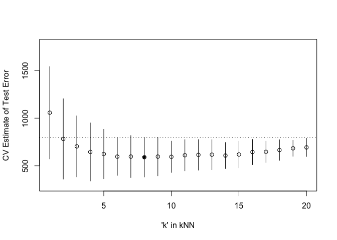

Homework 4
================
Jiayu Shi

``` r
## install.packages("caret")
library('manipulate')
library('MASS') ## for 'mcycle'
library('manipulate') ## for 'manipulate'
# Load the caret package

library(caret)
```

    ## Loading required package: ggplot2

    ## Loading required package: lattice

``` r
mcycle
```

    ##     times  accel
    ## 1     2.4    0.0
    ## 2     2.6   -1.3
    ## 3     3.2   -2.7
    ## 4     3.6    0.0
    ## 5     4.0   -2.7
    ## 6     6.2   -2.7
    ## 7     6.6   -2.7
    ## 8     6.8   -1.3
    ## 9     7.8   -2.7
    ## 10    8.2   -2.7
    ## 11    8.8   -1.3
    ## 12    8.8   -2.7
    ## 13    9.6   -2.7
    ## 14   10.0   -2.7
    ## 15   10.2   -5.4
    ## 16   10.6   -2.7
    ## 17   11.0   -5.4
    ## 18   11.4    0.0
    ## 19   13.2   -2.7
    ## 20   13.6   -2.7
    ## 21   13.8    0.0
    ## 22   14.6  -13.3
    ## 23   14.6   -5.4
    ## 24   14.6   -5.4
    ## 25   14.6   -9.3
    ## 26   14.6  -16.0
    ## 27   14.6  -22.8
    ## 28   14.8   -2.7
    ## 29   15.4  -22.8
    ## 30   15.4  -32.1
    ## 31   15.4  -53.5
    ## 32   15.4  -54.9
    ## 33   15.6  -40.2
    ## 34   15.6  -21.5
    ## 35   15.8  -21.5
    ## 36   15.8  -50.8
    ## 37   16.0  -42.9
    ## 38   16.0  -26.8
    ## 39   16.2  -21.5
    ## 40   16.2  -50.8
    ## 41   16.2  -61.7
    ## 42   16.4   -5.4
    ## 43   16.4  -80.4
    ## 44   16.6  -59.0
    ## 45   16.8  -71.0
    ## 46   16.8  -91.1
    ## 47   16.8  -77.7
    ## 48   17.6  -37.5
    ## 49   17.6  -85.6
    ## 50   17.6 -123.1
    ## 51   17.6 -101.9
    ## 52   17.8  -99.1
    ## 53   17.8 -104.4
    ## 54   18.6 -112.5
    ## 55   18.6  -50.8
    ## 56   19.2 -123.1
    ## 57   19.4  -85.6
    ## 58   19.4  -72.3
    ## 59   19.6 -127.2
    ## 60   20.2 -123.1
    ## 61   20.4 -117.9
    ## 62   21.2 -134.0
    ## 63   21.4 -101.9
    ## 64   21.8 -108.4
    ## 65   22.0 -123.1
    ## 66   23.2 -123.1
    ## 67   23.4 -128.5
    ## 68   24.0 -112.5
    ## 69   24.2  -95.1
    ## 70   24.2  -81.8
    ## 71   24.6  -53.5
    ## 72   25.0  -64.4
    ## 73   25.0  -57.6
    ## 74   25.4  -72.3
    ## 75   25.4  -44.3
    ## 76   25.6  -26.8
    ## 77   26.0   -5.4
    ## 78   26.2 -107.1
    ## 79   26.2  -21.5
    ## 80   26.4  -65.6
    ## 81   27.0  -16.0
    ## 82   27.2  -45.6
    ## 83   27.2  -24.2
    ## 84   27.2    9.5
    ## 85   27.6    4.0
    ## 86   28.2   12.0
    ## 87   28.4  -21.5
    ## 88   28.4   37.5
    ## 89   28.6   46.9
    ## 90   29.4  -17.4
    ## 91   30.2   36.2
    ## 92   31.0   75.0
    ## 93   31.2    8.1
    ## 94   32.0   54.9
    ## 95   32.0   48.2
    ## 96   32.8   46.9
    ## 97   33.4   16.0
    ## 98   33.8   45.6
    ## 99   34.4    1.3
    ## 100  34.8   75.0
    ## 101  35.2  -16.0
    ## 102  35.2  -54.9
    ## 103  35.4   69.6
    ## 104  35.6   34.8
    ## 105  35.6   32.1
    ## 106  36.2  -37.5
    ## 107  36.2   22.8
    ## 108  38.0   46.9
    ## 109  38.0   10.7
    ## 110  39.2    5.4
    ## 111  39.4   -1.3
    ## 112  40.0  -21.5
    ## 113  40.4  -13.3
    ## 114  41.6   30.8
    ## 115  41.6  -10.7
    ## 116  42.4   29.4
    ## 117  42.8    0.0
    ## 118  42.8  -10.7
    ## 119  43.0   14.7
    ## 120  44.0   -1.3
    ## 121  44.4    0.0
    ## 122  45.0   10.7
    ## 123  46.6   10.7
    ## 124  47.8  -26.8
    ## 125  47.8  -14.7
    ## 126  48.8  -13.3
    ## 127  50.6    0.0
    ## 128  52.0   10.7
    ## 129  53.2  -14.7
    ## 130  55.0   -2.7
    ## 131  55.0   10.7
    ## 132  55.4   -2.7
    ## 133  57.6   10.7

``` r
y <- mcycle$accel
x <- matrix(mcycle$times, length(mcycle$times), 1)

plot(x, y, xlab="Time (ms)", ylab="Acceleration (g)")
```

<!-- -->

# Randomly split the mcycle data into training (75%) and validation (25%) subsets.

``` r
data(mcycle)
# Split the data into training and test sets
set.seed(123) # Set seed for reproducibility
trainIndex <- createDataPartition(mcycle$times, p = 0.75, list = FALSE)
train <- mcycle[trainIndex, ]
test <- mcycle[-trainIndex, ]
```

# Using the mcycle data, consider predicting the mean acceleration as a function of time. Use the Nadaraya-Watson method with the k-NN kernel function to create a series of prediction models by varying the tuning parameter over a sequence of values.

``` r
## k-NN kernel function
## x  - n x p matrix of training inputs
## x0 - 1 x p input where to make prediction
## k  - number of nearest neighbors
kernel_k_nearest_neighbors <- function(x, x0, k=1) {
  ## compute distance betwen each x and x0
  z <- t(t(x) - x0)
  d <- sqrt(rowSums(z*z))

  ## initialize kernel weights to zero
  w <- rep(0, length(d))
  
  ## set weight to 1 for k nearest neighbors
  w[order(d)[1:k]] <- 1
  
  return(w)
}
```

``` r
## Make predictions using the NW method
## y  - n x 1 vector of training outputs
## x  - n x p matrix of training inputs
## x0 - m x p matrix where to make predictions
## kern  - kernel function to use
## ... - arguments to pass to kernel function
nadaraya_watson <- function(y, x, x0, kern, ...) {
  k <- t(apply(x0, 1, function(x0_) {
    k_ <- kern(x, x0_, ...)
    k_/sum(k_)
  }))
  yhat <- drop(k %*% y)
  return(yhat)
}
```

## Use the Nadaraya-Watson method with the k-NN kernel function to create a series of prediction models by varying the tuning parameter over a sequence of values.

### k = 1

``` r
x_plot <- matrix(seq(min(x),max(x),length.out=1000),1000,1)
plot(x, y, xlab="Time (ms)", ylab="Acceleration (g)")
lines(x_plot,nadaraya_watson(train$accel, train$times, x_plot,kern = kernel_k_nearest_neighbors, k=1),col="#882255", lwd=2)
```

<!-- -->

### k = 2

``` r
plot(x, y, xlab="Time (ms)", ylab="Acceleration (g)")
lines(x_plot,nadaraya_watson(train$accel, train$times, x_plot,kern = kernel_k_nearest_neighbors, k=2),col="#882255", lwd=2)
```

<!-- -->

### k = 5

``` r
plot(x, y, xlab="Time (ms)", ylab="Acceleration (g)")
lines(x_plot,nadaraya_watson(train$accel, train$times, x_plot,kern = kernel_k_nearest_neighbors, k=5),col="#882255", lwd=2)
```

<!-- -->

### k = 10

``` r
plot(x, y, xlab="Time (ms)", ylab="Acceleration (g)")
lines(x_plot,nadaraya_watson(train$accel, train$times, x_plot,kern = kernel_k_nearest_neighbors, k=10),col="#882255", lwd=2)
```

<!-- -->

### k = 20

``` r
plot(x, y, xlab="Time (ms)", ylab="Acceleration (g)")
lines(x_plot,nadaraya_watson(train$accel, train$times, x_plot,kern = kernel_k_nearest_neighbors, k=20),col="#882255", lwd=2)
```

<!-- -->

# With the squared-error loss function, compute and plot the training error, AIC, BIC, and validation error (using the validation data) as functions of the tuning parameter.

``` r
## Compute effective df using NW method
## y  - n x 1 vector of training outputs
## x  - n x p matrix of training inputs
## kern  - kernel function to use
## ... - arguments to pass to kernel function
effective_df <- function(y, x, kern, ...) {
  y_hat <- nadaraya_watson(y, x, x,
    kern=kern, ...)
  sum(diag(attr(y_hat, 'k')))
}

## loss function
## y    - train/test y
## yhat - predictions at train/test x
loss_squared_error <- function(y, yhat)
  (y - yhat)^2

## test/train error
## y    - train/test y
## yhat - predictions at train/test x
## loss - loss function
error <- function(y, yhat, loss=loss_squared_error)
  mean(loss(y, yhat))

## AIC
## y    - training y
## yhat - predictions at training x
## d    - effective degrees of freedom
aic <- function(y, yhat, d)
  error(y, yhat) + 2/length(y)*d

## BIC
## y    - training y
## yhat - predictions at training x
## d    - effective degrees of freedom
bic <- function(y, yhat, d)
  error(y, yhat) + log(length(y))/length(y)*d
```

``` r
edf = 0
for(i in 1:20){
  edf[i] = effective_df(train$accel, matrix(train$times), kern =  kernel_k_nearest_neighbors,k=i)
}

## training error
training_error_plot = 0
for (i in 1:20) {
  y_hat = nadaraya_watson(train$accel, train$times, matrix(train$times),kern = kernel_k_nearest_neighbors, k=i)
  training_error_plot[i] = error(train$accel,y_hat,loss=loss_squared_error)
}

## testing error
testing_error_plot = 0
for (i in 1:20) {
  y_hat = nadaraya_watson(train$accel, train$times, matrix(test$times),kern = kernel_k_nearest_neighbors, k=i)
  testing_error_plot[i] = error(test$accel,y_hat,loss=loss_squared_error)
}

## AIC
aic_plot = 0
for (i in 1:20) {
  y_hat = nadaraya_watson(train$accel, train$times, matrix(train$times),kern = kernel_k_nearest_neighbors, k=i)
  aic_plot[i] <- aic(train$accel,y_hat, edf[i])
}


## BIC
bic_plot = 0
for (i in 1:20) {
  y_hat = nadaraya_watson(train$accel, train$times, matrix(train$times),kern = kernel_k_nearest_neighbors, k=i)
  bic_plot[i] <- bic(train$accel,y_hat, edf[i])
}
```

``` r
plot(1:20, testing_error_plot,ylim=c(0,1300), xlab="tuning parameter: K", ylab="AIC, BIC, and error")
points(1:20, bic_plot,col="green")
points(1:20, aic_plot,col="red")
points(1:20, training_error_plot,col="blue")
```

<!-- -->

# For each value of the tuning parameter, Perform 5-fold cross-validation using the combined training and validation data. This results in 5 estimates of test error per tuning parameter value.

``` r
## 5-fold cross-validation of knnreg model
## create five folds
set.seed(99)
fold  <- createFolds(mcycle$accel, k=5)
print(fold)
```

    ## $Fold1
    ##  [1]  12  13  17  21  23  40  43  55  58  62  63  66  73  75  77  79  84 100 102
    ## [20] 107 108 115 116 120 122 124 125 126
    ## 
    ## $Fold2
    ##  [1]   1   4  18  19  22  26  27  28  29  32  33  46  50  54  60  64  65  81  89
    ## [20]  93  95  98 118 123 130 131
    ## 
    ## $Fold3
    ##  [1]   5  10  16  25  31  36  37  47  48  53  69  70  72  78  83  85  87  91  92
    ## [20] 103 105 121 127 128 132
    ## 
    ## $Fold4
    ##  [1]   3   7   9  11  14  15  20  30  35  39  41  45  49  59  61  67  68  71  82
    ## [20]  88  90  94  99 104 106 110 119
    ## 
    ## $Fold5
    ##  [1]   2   6   8  24  34  38  42  44  51  52  56  57  74  76  80  86  96  97 101
    ## [20] 109 111 112 113 114 117 129 133

``` r
sapply(fold, length)  ## not all the same length
```

    ## Fold1 Fold2 Fold3 Fold4 Fold5 
    ##    28    26    25    27    27

``` r
cvknnreg <- function(kNN, flds=fold) {
  cverr <- rep(NA, length(flds))
  for(test_idx in 1:length(flds)) { ## for each fold
    
    ## get training and testing data
    mcycle_train <- mcycle[-flds[[test_idx]],]
    mcycle_test <- mcycle[ flds[[test_idx]],]
    
    ## fit kNN model to training data
    knn_fit <- knnreg(accel ~ times,
                      k=kNN, data=mcycle_train)
    
    ## compute test error on testing data
    pre_test <- predict(knn_fit, mcycle_test)
    cverr[test_idx] <- mean((mcycle_test$accel - pre_test)^2)
  }
  return(cverr)
}
## Compute 5-fold CV for kNN = 1:20
cverrs <- sapply(1:20, cvknnreg)
print(cverrs) ## rows are k-folds (1:5), cols are kNN (1:20)
```

    ##           [,1]      [,2]      [,3]      [,4]     [,5]     [,6]     [,7]
    ## [1,] 1767.7360 1321.0338 1076.9306 1049.8063 995.4468 868.2589 923.4972
    ## [2,]  633.4279  472.0304  394.3057  373.0921 360.7330 428.8437 412.9679
    ## [3,] 1333.6291 1073.4456 1020.2305  885.3768 783.6891 744.3886 727.8425
    ## [4,]  873.3062  750.9263  552.2779  401.5632 465.0125 478.6303 471.0138
    ## [5,]  677.6204  294.2975  477.0239  518.8134 514.1729 462.2819 449.7690
    ##          [,8]     [,9]    [,10]    [,11]    [,12]    [,13]    [,14]    [,15]
    ## [1,] 902.2311 879.2123 839.9313 879.7281 872.8695 887.8724 834.0756 829.3594
    ## [2,] 417.9850 400.7601 451.1730 477.8807 502.3134 506.8410 508.5500 529.8898
    ## [3,] 703.7470 722.5084 654.1056 630.2972 649.3787 616.9251 631.4310 688.6964
    ## [4,] 479.2291 546.8360 586.7075 585.9919 582.1757 558.6090 566.8790 561.7893
    ## [5,] 449.2712 434.4999 440.2326 482.6187 468.3779 513.1676 498.6039 484.0651
    ##         [,16]    [,17]    [,18]    [,19]    [,20]
    ## [1,] 844.9761 812.5574 796.5548 775.3552 782.0553
    ## [2,] 585.2893 613.7561 626.8228 713.3462 744.0627
    ## [3,] 711.5149 700.8637 748.2415 714.1435 721.7608
    ## [4,] 557.4319 573.3798 632.4241 666.3994 683.8638
    ## [5,] 523.4649 531.6988 522.6252 550.2690 534.0860

``` r
cverrs_mean <- apply(cverrs, 2, mean)
cverrs_sd   <- apply(cverrs, 2, sd)
```

# Plot the CV-estimated test error (average of the five estimates from each fold) as a function of the tuning parameter. Add vertical line segments to the figure (using the segments function in R) that represent one “standard error” of the CV-estimated test error (standard deviation of the five estimates from each fold).

``` r
## Plot the results of 5-fold CV for kNN = 1:20
plot(x=1:20, y=cverrs_mean, 
     ylim=range(cverrs),
     xlab="'k' in kNN", ylab="CV Estimate of Test Error")
segments(x0=1:20, x1=1:20,
         y0=cverrs_mean-cverrs_sd,
         y1=cverrs_mean+cverrs_sd)
best_idx <- which.min(cverrs_mean)
points(x=best_idx, y=cverrs_mean[best_idx], pch=20)
abline(h=cverrs_mean[best_idx] + cverrs_sd[best_idx], lty=3)
```

<!-- -->

# Interpret the resulting figures and select a suitable value for the tuning parameter.

The least complex model within one standard error of the best is chosen.
The suitable value for tuning parameter is 20.
