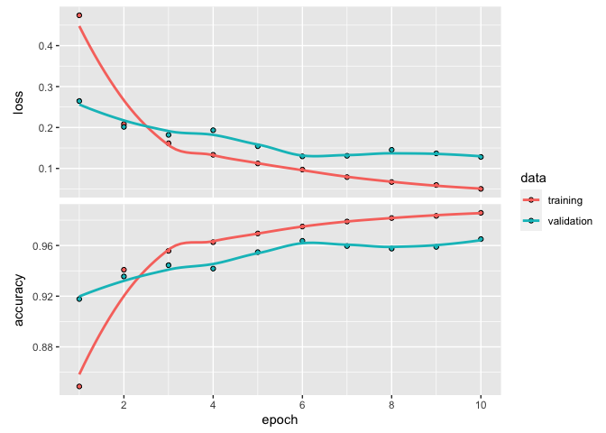

HW6
================
Jiayu Shi
2023-04-13

``` r
# install.packages("keras")
```

``` r
# install_tensorflow()
```

``` r
library(tensorflow)
library(keras)
library(reticulate)
library(tidyr)
library(ggplot2)
```

``` r
# Set the path to the zip.train file
path_to_zip_train <- "/Users/stoneman/Library/CloudStorage/OneDrive-Vanderbilt/Machine\ Learning/Machine-Learning-HW/HW6/zip.train"

# Read in the file using read.table
train_data  <- read.table(path_to_zip_train, header = FALSE)

# View the first few rows of the dataset
head(train_data)
```

    ##   V1 V2 V3 V4     V5     V6     V7     V8     V9    V10    V11    V12    V13
    ## 1  6 -1 -1 -1 -1.000 -1.000 -1.000 -1.000 -0.631  0.862 -0.167 -1.000 -1.000
    ## 2  5 -1 -1 -1 -0.813 -0.671 -0.809 -0.887 -0.671 -0.853 -1.000 -1.000 -0.774
    ## 3  4 -1 -1 -1 -1.000 -1.000 -1.000 -1.000 -1.000 -1.000 -0.996  0.147  1.000
    ## 4  7 -1 -1 -1 -1.000 -1.000 -0.273  0.684  0.960  0.450 -0.067 -0.679 -1.000
    ## 5  3 -1 -1 -1 -1.000 -1.000 -0.928 -0.204  0.751  0.466  0.234 -0.809 -1.000
    ## 6  6 -1 -1 -1 -1.000 -1.000 -0.397  0.983 -0.535 -1.000 -1.000 -1.000 -1.000
    ##      V14    V15    V16 V17 V18 V19 V20    V21    V22    V23    V24    V25
    ## 1 -1.000 -1.000 -1.000  -1  -1  -1  -1 -1.000 -1.000 -1.000 -0.992  0.297
    ## 2 -0.180  0.052 -0.241  -1  -1  -1  -1  0.392  1.000  0.857  0.727  1.000
    ## 3 -0.189 -1.000 -1.000  -1  -1  -1  -1 -1.000 -1.000 -1.000 -1.000 -1.000
    ## 4 -1.000 -1.000 -1.000  -1  -1  -1  -1 -1.000 -0.114  0.974  0.917  0.734
    ## 5 -1.000 -1.000 -1.000  -1  -1  -1  -1 -1.000 -0.370  0.739  1.000  1.000
    ## 6 -1.000 -1.000 -1.000  -1  -1  -1  -1 -1.000 -1.000  0.692  0.536 -0.767
    ##      V26    V27    V28    V29    V30    V31    V32 V33 V34 V35 V36    V37
    ## 1  1.000  0.307 -1.000 -1.000 -1.000 -1.000 -1.000  -1  -1  -1  -1 -1.000
    ## 2  0.805  0.613  0.613  0.860  1.000  1.000  0.396  -1  -1  -1  -1 -0.548
    ## 3 -1.000 -0.882  1.000  0.390 -0.811 -1.000 -1.000  -1  -1  -1  -1 -1.000
    ## 4  0.994  1.000  0.973  0.391 -0.421 -0.976 -1.000  -1  -1  -1  -1 -0.323
    ## 5  1.000  1.000  0.644 -0.890 -1.000 -1.000 -1.000  -1  -1  -1  -1 -1.000
    ## 6 -1.000 -1.000 -1.000 -1.000 -1.000 -1.000 -1.000  -1  -1  -1  -1 -1.000
    ##      V38    V39    V40    V41    V42    V43    V44    V45 V46    V47    V48
    ## 1 -1.000 -1.000 -0.410  1.000  0.986 -0.565 -1.000 -1.000  -1 -1.000 -1.000
    ## 2  1.000  1.000  1.000  1.000  1.000  1.000  1.000  1.000   1  1.000  0.875
    ## 3 -1.000 -1.000 -1.000 -1.000 -1.000 -0.715  1.000  0.029  -1 -1.000 -1.000
    ## 4  0.991  0.622 -0.738 -1.000 -0.639  0.023  0.871  1.000   1 -0.432 -1.000
    ## 5  0.616  1.000  0.688 -0.455 -0.731  0.659  1.000 -0.287  -1 -1.000 -1.000
    ## 6 -0.921  0.928 -0.118 -1.000 -1.000 -1.000 -1.000 -1.000  -1 -1.000 -1.000
    ##      V49 V50 V51 V52    V53    V54    V55    V56 V57    V58    V59    V60
    ## 1 -1.000  -1  -1  -1 -1.000 -1.000 -0.683  0.825   1  0.562 -1.000 -1.000
    ## 2 -0.957  -1  -1  -1 -0.786  0.961  1.000  1.000   1  0.727  0.403  0.403
    ## 3 -1.000  -1  -1  -1 -1.000 -0.888 -0.912 -1.000  -1 -1.000 -0.549  1.000
    ## 4 -1.000  -1  -1  -1  0.409  1.000  0.000 -1.000  -1 -1.000 -1.000 -0.842
    ## 5 -1.000  -1  -1  -1 -1.000 -0.376 -0.186 -0.874  -1 -1.000 -0.014  1.000
    ## 6 -1.000  -1  -1  -1 -1.000 -0.394  1.000 -0.596  -1 -1.000 -1.000 -1.000
    ##      V61    V62    V63   V64 V65 V66 V67    V68    V69    V70    V71    V72
    ## 1 -1.000 -1.000 -1.000 -1.00  -1  -1  -1 -1.000 -1.000 -0.938  0.540  1.000
    ## 2  0.171 -0.314 -0.314 -0.94  -1  -1  -1 -1.000 -0.298  1.000  1.000  1.000
    ## 3  0.361 -1.000 -1.000 -1.00  -1  -1  -1 -1.000 -0.938  0.694  0.057 -1.000
    ## 4  0.714  1.000 -0.534 -1.00  -1  -1  -1 -0.879  0.965  1.000 -0.713 -1.000
    ## 5 -0.253 -1.000 -1.000 -1.00  -1  -1  -1 -1.000 -1.000 -1.000 -1.000 -1.000
    ## 6 -1.000 -1.000 -1.000 -1.00  -1  -1  -1 -1.000 -1.000  0.060  0.900 -0.951
    ##      V73    V74    V75    V76    V77    V78    V79 V80 V81 V82 V83    V84
    ## 1  0.778 -0.715 -1.000 -1.000 -1.000 -1.000 -1.000  -1  -1  -1  -1 -1.000
    ## 2  0.440  0.056 -0.755 -1.000 -1.000 -1.000 -1.000  -1  -1  -1  -1 -1.000
    ## 3 -1.000 -1.000 -0.382  1.000  0.511 -1.000 -1.000  -1  -1  -1  -1 -1.000
    ## 4 -1.000 -1.000 -1.000 -0.606  0.977  0.695 -0.906  -1  -1  -1  -1 -0.528
    ## 5 -1.000 -0.978  0.501  1.000 -0.540 -1.000 -1.000  -1  -1  -1  -1 -1.000
    ## 6 -1.000 -1.000 -1.000 -0.647  0.455 -0.333 -1.000  -1  -1  -1  -1 -1.000
    ##      V85    V86    V87    V88    V89    V90    V91    V92    V93    V94 V95 V96
    ## 1 -1.000  0.100  1.000  0.922 -0.439 -1.000 -1.000 -1.000 -1.000 -1.000  -1  -1
    ## 2  0.366  1.000  1.000  1.000  1.000  1.000  0.889 -0.081 -0.920 -1.000  -1  -1
    ## 3 -0.311  1.000 -0.043 -1.000 -1.000 -1.000 -0.648  1.000  0.644 -1.000  -1  -1
    ## 4  1.000  0.931 -0.888 -1.000 -1.000 -1.000 -0.949  0.559  0.984 -0.363  -1  -1
    ## 5 -1.000 -1.000 -0.998 -0.341  0.296  0.371  1.000  0.417 -0.989 -1.000  -1  -1
    ## 6 -1.000  0.259  0.676 -1.000 -1.000 -1.000 -0.984  0.677  0.981  0.551  -1  -1
    ##   V97 V98 V99  V100   V101   V102   V103   V104   V105  V106   V107   V108
    ## 1  -1  -1  -1 -1.00 -0.257  0.950  1.000 -0.162 -1.000 -1.00 -1.000 -0.987
    ## 2  -1  -1  -1 -1.00 -0.396  0.886  0.974  0.851  0.851  0.95  1.000  1.000
    ## 3  -1  -1  -1 -1.00  0.489  1.000 -0.493 -1.000 -1.000 -1.00 -0.564  1.000
    ## 4  -1  -1  -1 -0.97 -0.266 -0.555 -1.000 -1.000 -1.000 -1.00 -0.186  1.000
    ## 5  -1  -1  -1 -1.00 -1.000 -1.000 -0.008  1.000  1.000  1.00  1.000  0.761
    ## 6  -1  -1  -1 -1.00 -0.994  0.699  0.305 -1.000 -1.000 -1.00 -0.499  1.000
    ##     V109   V110 V111 V112 V113 V114 V115   V116   V117   V118   V119   V120
    ## 1 -0.714 -0.832   -1   -1   -1   -1   -1 -0.797  0.909  1.000  0.300 -0.961
    ## 2  0.539 -0.754   -1   -1   -1   -1   -1 -1.000 -1.000 -0.886 -0.505 -1.000
    ## 3  0.693 -1.000   -1   -1   -1   -1   -1 -0.966  0.988  1.000 -0.893 -1.000
    ## 4  0.488 -1.000   -1   -1   -1   -1   -1 -1.000 -1.000 -1.000 -1.000 -1.000
    ## 5 -0.731 -1.000   -1   -1   -1   -1   -1 -1.000 -1.000 -1.000  0.242  1.000
    ## 6 -0.092  0.751   -1   -1   -1   -1   -1 -1.000 -0.923  0.966 -0.107 -1.000
    ##   V121   V122   V123  V124   V125   V126   V127 V128 V129 V130 V131   V132
    ## 1   -1 -1.000 -0.550 0.485  0.996  0.867  0.092   -1   -1   -1   -1  0.278
    ## 2   -1 -0.649  0.405 1.000  1.000  0.653 -0.838   -1   -1   -1   -1 -1.000
    ## 3   -1 -1.000 -0.397 1.000  0.903 -0.977 -1.000   -1   -1   -1   -1 -0.559
    ## 4   -1 -1.000  0.697 0.992 -0.458 -1.000 -1.000   -1   -1   -1   -1 -1.000
    ## 5    1  0.319  0.259 1.000  0.742 -0.757 -1.000   -1   -1   -1   -1 -1.000
    ## 6   -1 -1.000 -0.300 0.854 -0.382  0.617 -1.000   -1   -1   -1   -1 -1.000
    ##     V133   V134   V135   V136   V137   V138   V139   V140   V141   V142   V143
    ## 1  1.000  0.877 -0.824 -1.000 -0.905  0.145  0.977  1.000  1.000  1.000  0.990
    ## 2 -1.000 -1.000 -1.000 -1.000 -1.000 -1.000 -1.000 -0.550  0.993  1.000  0.618
    ## 3  1.000  1.000 -0.297 -1.000 -1.000 -1.000 -0.611  1.000  0.873 -0.698 -0.552
    ## 4 -1.000 -1.000 -1.000 -1.000 -1.000 -0.341  1.000  0.608 -1.000 -1.000 -1.000
    ## 5 -1.000 -1.000 -0.975 -0.467 -0.989 -1.000 -1.000 -0.171  0.998  0.669 -0.945
    ## 6 -0.409  1.000 -0.529 -1.000 -1.000 -1.000  0.048  0.614 -0.268  0.544 -1.000
    ##     V144 V145  V146   V147   V148   V149   V150   V151   V152   V153   V154
    ## 1 -0.745   -1 -1.00 -0.950  0.847  1.000  0.327 -1.000 -1.000  0.355  1.000
    ## 2 -0.869   -1 -0.96 -0.512  0.134 -0.343 -0.796 -1.000 -1.000 -1.000 -1.000
    ## 3 -1.000   -1 -1.00 -1.000 -0.126  1.000  1.000  0.766 -0.764 -1.000 -1.000
    ## 4 -1.000   -1 -1.00 -1.000 -1.000 -1.000 -1.000 -1.000 -1.000 -1.000  0.471
    ## 5 -1.000   -1 -1.00 -1.000 -1.000 -1.000 -1.000 -1.000 -1.000 -1.000 -1.000
    ## 6 -1.000   -1 -1.00 -1.000 -1.000  0.050  0.971 -0.839 -1.000 -1.000 -1.000
    ##     V155   V156   V157   V158   V159   V160 V161   V162  V163   V164   V165
    ## 1  0.655 -0.109 -0.185  1.000  0.988 -0.723   -1 -1.000 -0.63  1.000  1.000
    ## 2 -1.000 -1.000 -0.432  0.994  1.000  0.223   -1  0.426  1.00  1.000  1.000
    ## 3 -0.577  1.000  0.933  0.484 -0.197 -1.000   -1 -1.000 -1.00 -0.818 -0.355
    ## 4  0.998 -0.416 -1.000 -1.000 -1.000 -1.000   -1 -1.000 -1.00 -1.000 -1.000
    ## 5 -1.000 -1.000  0.228  1.000  0.038 -1.000   -1 -1.000 -1.00 -1.000 -1.000
    ## 6  0.172  0.526 -0.003  0.307 -1.000 -1.000   -1 -1.000 -1.00 -1.000  0.398
    ##     V166   V167   V168   V169   V170   V171   V172   V173   V174   V175   V176
    ## 1  0.068 -0.925  0.113  0.960  0.308 -0.884 -1.000 -0.075  1.000  0.641 -0.995
    ## 2  0.214 -1.000 -1.000 -1.000 -1.000 -1.000 -1.000 -1.000  0.292  1.000  0.967
    ## 3  0.334  1.000  0.868 -0.289 -0.677 -0.596  1.000  1.000  1.000 -0.581 -1.000
    ## 4 -1.000 -1.000 -1.000 -0.644  0.963  0.590 -0.999 -1.000 -1.000 -1.000 -1.000
    ## 5 -1.000 -1.000 -1.000 -1.000 -1.000 -1.000 -1.000 -0.826  0.918  0.933 -0.794
    ## 6  0.459 -1.000 -1.000 -1.000 -1.000  0.372  0.555  0.520 -0.045 -1.000 -1.000
    ##    V177   V178   V179   V180   V181   V182   V183 V184   V185   V186   V187
    ## 1 -1.00 -1.000 -0.677  1.000  1.000  0.753  0.341    1  0.707 -0.942 -1.000
    ## 2 -0.88  0.449  1.000  0.896 -0.094 -0.750 -1.000   -1 -1.000 -1.000 -1.000
    ## 3 -1.00 -1.000 -1.000 -1.000 -1.000 -0.954  0.118    1  1.000  1.000  1.000
    ## 4 -1.00 -1.000 -1.000 -1.000 -1.000 -1.000 -1.000   -1  0.061  1.000 -0.079
    ## 5 -1.00 -1.000 -1.000 -0.666  0.337  0.224 -0.908   -1 -1.000 -1.000 -1.000
    ## 6 -1.00 -1.000 -1.000 -1.000  0.671  0.176 -1.000   -1 -1.000 -1.000  0.236
    ##     V188   V189   V190   V191   V192   V193   V194   V195   V196   V197   V198
    ## 1 -1.000  0.545  1.000  0.027 -1.000 -1.000 -1.000 -0.903  0.792  1.000  1.000
    ## 2 -1.000 -1.000 -0.627  1.000  1.000  0.198 -0.105  1.000  1.000  1.000  0.639
    ## 3  1.000  0.973 -0.092 -0.995 -1.000 -1.000 -1.000 -1.000 -1.000 -1.000 -1.000
    ## 4 -1.000 -1.000 -1.000 -1.000 -1.000 -1.000 -1.000 -1.000 -1.000 -1.000 -1.000
    ## 5 -1.000 -1.000  0.418  1.000 -0.258 -1.000 -1.000 -0.246  1.000  1.000  0.355
    ## 6  0.934  0.971 -0.712 -1.000 -1.000 -1.000 -1.000 -1.000 -1.000  0.763  0.084
    ##     V199   V200   V201   V202   V203   V204   V205   V206   V207   V208   V209
    ## 1  1.000  1.000  0.536  0.184  0.812  0.837  0.978  0.864 -0.630 -1.000 -1.000
    ## 2 -0.168 -0.314 -0.446 -1.000 -1.000 -0.999 -0.337  0.147  0.996  1.000  0.667
    ## 3 -0.993 -0.464  0.046  0.290  0.457  1.000  0.721 -1.000 -1.000 -1.000 -1.000
    ## 4 -1.000 -1.000  0.773  0.958 -0.714 -1.000 -1.000 -1.000 -1.000 -1.000 -1.000
    ## 5 -0.958 -1.000 -1.000 -1.000 -1.000 -1.000 -1.000 -0.077  1.000  0.344 -1.000
    ## 6 -1.000 -1.000 -1.000 -1.000  0.073  1.000  0.265 -1.000 -1.000 -1.000 -1.000
    ##     V210   V211   V212   V213   V214   V215   V216   V217   V218   V219   V220
    ## 1 -1.000 -1.000 -0.452  0.828  1.000  1.000  1.000  1.000  1.000  1.000  1.000
    ## 2 -0.808  0.065  0.993  1.000  1.000  1.000  1.000  0.996  0.970  0.970  0.970
    ## 3 -1.000 -1.000 -1.000 -1.000 -1.000 -1.000 -1.000 -1.000 -1.000 -0.426  1.000
    ## 4 -1.000 -1.000 -1.000 -1.000 -1.000 -1.000 -0.545  0.989  0.432 -1.000 -1.000
    ## 5 -1.000  0.075  1.000  1.000  0.649  0.256 -0.200 -0.351 -0.733 -0.733 -0.733
    ## 6 -1.000 -1.000 -1.000  0.563  0.210 -1.000 -1.000 -0.930 -0.127  0.890  0.935
    ##     V221   V222 V223   V224   V225 V226   V227   V228   V229   V230   V231
    ## 1  1.000  0.135   -1 -1.000 -1.000   -1 -1.000 -1.000 -0.483  0.813  1.000
    ## 2  0.998  1.000    1  1.000  0.109   -1 -1.000 -0.830 -0.242  0.350  0.800
    ## 3  0.555 -1.000   -1 -1.000 -1.000   -1 -1.000 -1.000 -1.000 -1.000 -1.000
    ## 4 -1.000 -1.000   -1 -1.000 -1.000   -1 -1.000 -1.000 -1.000 -1.000 -1.000
    ## 5 -0.433  0.649    1  0.093 -1.000   -1 -0.959 -0.062  0.821  1.000  1.000
    ## 6 -0.845 -1.000   -1 -1.000 -1.000   -1 -1.000 -1.000  0.093  0.793 -0.205
    ##     V232   V233   V234   V235   V236   V237   V238   V239   V240  V241 V242
    ## 1  1.000  1.000  1.000  1.000  1.000  0.219 -0.943 -1.000 -1.000 -1.00   -1
    ## 2  1.000  1.000  1.000  1.000  1.000  1.000  1.000  1.000  0.616 -0.93   -1
    ## 3 -1.000 -1.000 -1.000  0.024  1.000  0.388 -1.000 -1.000 -1.000 -1.00   -1
    ## 4 -0.348  1.000  0.798 -0.935 -1.000 -1.000 -1.000 -1.000 -1.000 -1.00   -1
    ## 5  1.000  1.000  1.000  1.000  1.000  1.000  1.000  0.583 -0.843 -1.00   -1
    ## 6  0.214  0.746  0.918  0.692  0.954 -0.882 -1.000 -1.000 -1.000 -1.00   -1
    ##   V243 V244   V245   V246   V247   V248   V249   V250   V251   V252   V253
    ## 1   -1   -1 -1.000 -0.974 -0.429  0.304  0.823  1.000  0.482 -0.474 -0.991
    ## 2   -1   -1 -1.000 -1.000 -0.858 -0.671 -0.671 -0.033  0.761  0.762  0.126
    ## 3   -1   -1 -1.000 -1.000 -1.000 -1.000 -1.000 -1.000 -0.109  1.000 -0.179
    ## 4   -1   -1 -1.000 -1.000 -1.000 -0.318  1.000  0.536 -0.987 -1.000 -1.000
    ## 5   -1   -1 -0.877 -0.326  0.174  0.466  0.639  1.000  1.000  0.791  0.439
    ## 6   -1   -1 -0.898  0.323  1.000  0.803  0.015 -0.862 -0.871 -0.437 -1.000
    ##     V254   V255   V256 V257
    ## 1 -1.000 -1.000 -1.000   -1
    ## 2 -0.095 -0.671 -0.828   -1
    ## 3 -1.000 -1.000 -1.000   -1
    ## 4 -1.000 -1.000 -1.000   -1
    ## 5 -0.199 -0.883 -1.000   -1
    ## 6 -1.000 -1.000 -1.000   -1

``` r
train_labels <- train_data$V1
train_pixels <- as.matrix(train_data[, -1])
train_images <- array_reshape(train_pixels, c(nrow(train_pixels), 16, 16, 1))
```

``` r
# Define the model architecture
input_shape <- c(16, 16, 1)
# Create a custom shared convolutional layer
shared_conv_layer <- layer_conv_2d(filters = 2, kernel_size = c(8, 8), padding = "same", activation = "relu", input_shape = input_shape)

# Define the model architecture
input <- layer_input(shape = input_shape, name = "Input")
x1 <- shared_conv_layer(input)
x2 <- shared_conv_layer(input)
merged <- layer_add(list(x1, x2))
conv2 <- layer_conv_2d(filters = 4, kernel_size = c(4, 4), padding = "same", activation = "relu", name = "Conv_Layer_2")(merged)
flat <- layer_flatten()(conv2)
output <- layer_dense(units = 10, activation = 'softmax', name = "Output_Layer")(flat)

# Create the model
model <- keras_model(inputs = input, outputs = output)

# Compile the model
model %>% compile(
  loss = 'sparse_categorical_crossentropy',
  optimizer = optimizer_rmsprop(lr = 0.001),
  metrics = c('accuracy')
)

# Train the model
history <- model %>% fit(
  train_images, train_labels,
  epochs = 10,
  batch_size = 32,
  validation_split = 0.2
)
# Plot the training history
plot(history)
```

<!-- -->
